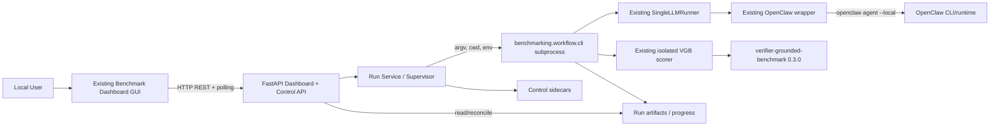
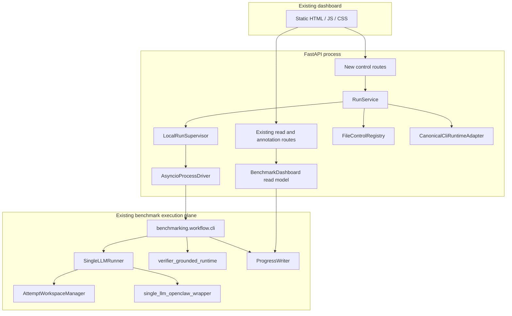
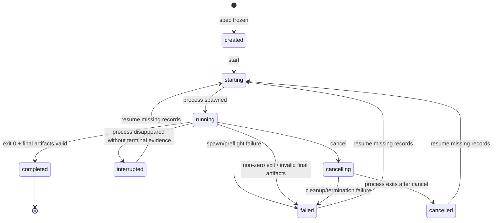
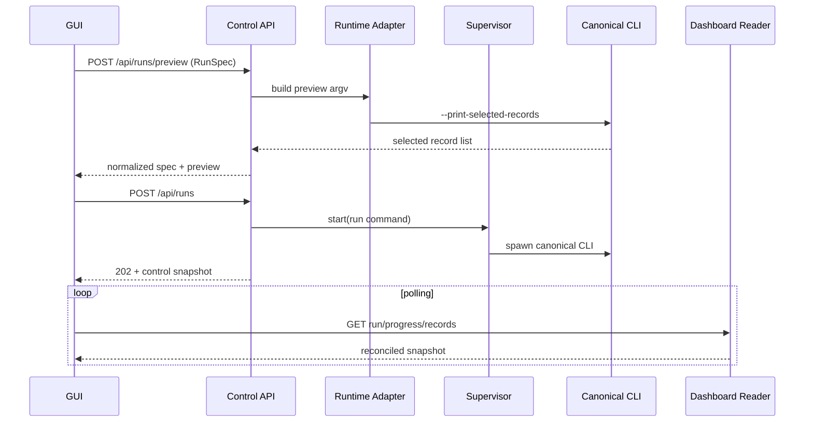
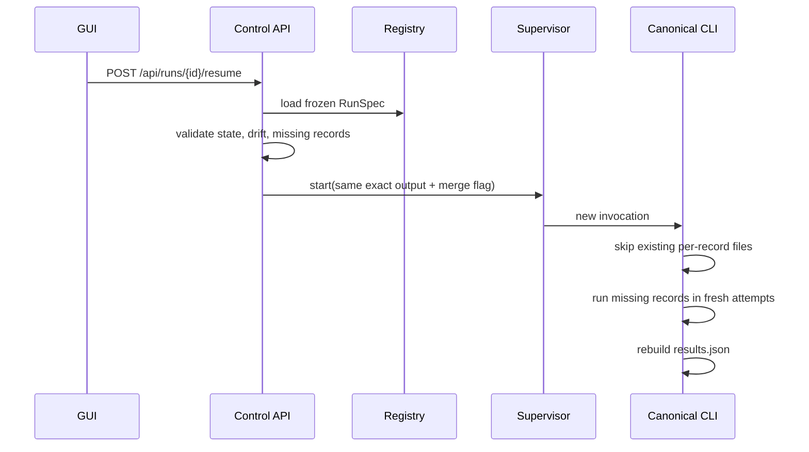
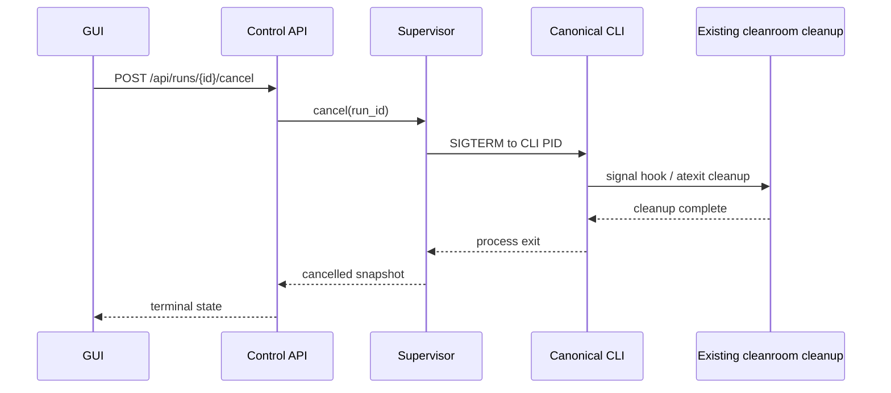

# Benchmark Orchestrator Architecture Design

- 状态：`REVISED`
- 修订日期：2026-07-21
- 适用范围：OpenClaw-only MVP

## 1. 目的与边界

本文定义 Benchmark Orchestrator 的模块关系、Adapter 边界、Launcher 分层、GUI 通信、Run
状态机和 Benchmark Package 接口。

首版不是新建一个 benchmark engine，而是在现有 `~/.openclaw/workspace/benchmarking` 上增加薄
控制面。以下能力已经存在，并明确不在 Orchestrator 内重写：

- OpenClaw agent 调用和 JSON/transcript 结果收集；
- session、retry attempt 和 workspace 隔离；
- workspace audit/archive/quarantine；
- VGB release pin、dataset sync 和独立 scorer；
- record 选择、timeout/retry 和评分；
- per-record checkpoint、progress、aggregate 和 dashboard read model。

## 2. 架构决策摘要

| 主题 | 决策 | 理由 |
| --- | --- | --- |
| 系统形态 | 现有 runtime 上的本地薄控制面 | 最大化复用已验证实现 |
| Harness | 仅 OpenClaw | 当前只有一个已实现且在范围内的 harness |
| 执行入口 | canonical CLI 子进程 | 保留全部现有隔离、retry、评分和产物语义 |
| OpenClaw 调用 | 由现有 runner/wrapper 内部完成 | 避免两套命令和 JSON contract |
| VGB 调用 | 由现有 isolated runtime 完成 | Orchestrator 不接触 package 私有数据或 scorer 环境 |
| GUI | 扩展现有 FastAPI + static JS/CSS dashboard | 不复制 read model，不引入 React 重写成本 |
| GUI 通信 | 同源 REST + 短轮询 | 当前 API 已存在；MVP 无 token stream 需求 |
| 运行真相 | per-record/progress/results 文件 | 与 canonical CLI checkpoint 一致 |
| 控制持久化 | 小型 JSON/YAML sidecar | 只保存进程和用户意图，不复制 task state |
| Run 目录 | canonical 分类层级内的 exact output | 启动前即可冻结路径，同时兼容当前 dashboard 递归发现 |
| Resume | 同目录 + `--merge-existing-per-record` | 直接复用现有缺失项续跑能力 |
| Cancel | 先 SIGTERM CLI，再超时升级 | 让现有 cleanroom signal hook 完成回收 |
| Run 并发 | 全局最多一个 active Run | 首版控制本机 provider、CPU/xTB 和清理资源竞争 |
| 插件 | MVP 不提供 Harness plugin contract | 没有第二实现，抽象没有可验证消费者 |

## 3. 系统上下文



信任与所有权边界：

- Browser 只访问 loopback FastAPI，不接收 OpenClaw credential；
- Control API 只启动 canonical CLI，不直接调用 OpenClaw；
- canonical CLI 独占 benchmark artifacts 的写入权；
- Orchestrator 只写独立 control root，不修改 per-record 或 results；
- VGB scorer runtime 与 agent runtime 隔离；
- workspace runtime guard/transcript audit 是污染防护，不是 OS sandbox。

## 4. 容器与组件



### 4.1 新增组件职责

| 组件 | 负责 | 不负责 |
| --- | --- | --- |
| Control routes | schema 校验、命令映射、HTTP 状态码 | 状态机和进程细节 |
| RunService | create/preview/start/cancel/resume 用例、幂等 | 执行 record 或评分 |
| CanonicalCliRuntimeAdapter | capability、selector preview、白名单 argv 构造 | 调用 `openclaw agent` |
| LocalRunSupervisor | 每 Run 单 invocation、进程身份、退出对账 | 解释 per-record |
| ProcessDriver | spawn、signal、wait、stdout/stderr 文件 | benchmark 语义 |
| FileControlRegistry | normalized spec、control state、invocation history | task checkpoint |

### 4.2 复用组件职责

| 组件 | 既有职责 |
| --- | --- |
| `benchmarking.workflow.cli` | selector、配置、groups、waves、aggregate、manifest |
| `SingleLLMRunner` | attempt、timeout retry、answer contract、错误分类 |
| OpenClaw wrapper | `openclaw agent --local`、stdout/transcript recovery、rescue |
| `AttemptWorkspaceManager` | prepare、lease、audit、archive/quarantine、fail closed |
| VGB runtime | release 校验、isolated Python、公共 API 评分 |
| `ProgressWriter` | `events.jsonl` 和 `state.json` |
| `BenchmarkDashboard` | 扫描 Run、读取 record/artifact、progress reconciliation |

## 5. 模块依赖规则

建议在现有 OpenClaw workspace 内增量实现，保持 dashboard 与 runtime 在同一个受版本控制的 Python
环境中：

```text
benchmarking.dashboard.app
  -> benchmarking.control.api
    -> benchmarking.control.service
      -> benchmarking.control.runtime_adapter
      -> benchmarking.control.supervisor
      -> benchmarking.control.registry
        -> Python stdlib / shared path helpers

benchmarking.dashboard.service
  -> existing run artifact readers

benchmarking.workflow.cli
  -> existing runners/runtime/scoring/dashboard.progress
```

依赖约束：

1. `benchmarking.control` 可以依赖 canonical CLI 的稳定常量或运行它，但不得 import runner 私有
   函数来执行任务；
2. `control` 不 import `openclaw`、VGB package、`SingleLLMRunner` 或 workspace manager；
3. `dashboard.service` 保持 read-only，不通过读取 API 修改 execution artifact；
4. `workflow.cli` 不依赖 control API/registry，CLI 仍可独立运行；
5. static GUI 只使用 HTTP API，不读取本机文件路径；
6. control registry 与 annotation SQLite 相互独立；annotation 数据不是执行状态；
7. 不通过 `PYTHONPATH` 把独立 Benchmark-Orchestrator checkout 注入 agent/scorer 子进程。

`/Users/xutao/Benchmark-Orchestrator` 当前作为设计文档工作区。MVP 实现应与现有
`benchmarking` package 同仓演进；若以后拆仓，应先把执行面发布为版本化 package 或稳定 RPC，
不能依赖未版本化绝对路径 import。

## 6. Adapter 接口定义

### 6.1 为什么不定义 HarnessAdapter

MVP 唯一 Harness 是 OpenClaw，而且 OpenClaw 已经被封装在 existing runner/wrapper 内。此时再设计
`HarnessAdapter -> LauncherBackend -> GatewayDriver` 会制造第二条调用路径，并使两套实现分别承担
session、workspace、timeout 和 JSON 兼容责任。

因此 MVP 的 Adapter 边界位于“控制面到完整 benchmark runtime”之间，而不是位于“benchmark 到
OpenClaw”之间。

### 6.2 BenchmarkRuntimeAdapter

概念接口如下：

```python
from dataclasses import dataclass
from pathlib import Path
from typing import Mapping, Protocol, Sequence


@dataclass(frozen=True)
class RuntimeCommand:
    argv: tuple[str, ...]
    cwd: Path
    env: Mapping[str, str]


@dataclass(frozen=True)
class RuntimeCapabilities:
    datasets: tuple[str, ...]
    groups: tuple[str, ...]
    thinking_levels: tuple[str, ...]
    runtime_revision: str | None


class BenchmarkRuntimeAdapter(Protocol):
    def inspect_capabilities(self) -> RuntimeCapabilities: ...

    def build_preview_command(self, spec: "RunSpec") -> RuntimeCommand: ...

    def parse_preview(self, stdout: str) -> Sequence["SelectedRecord"]: ...

    def build_run_command(
        self,
        spec: "RunSpec",
        *,
        resume: bool,
    ) -> RuntimeCommand: ...
```

唯一实现 `CanonicalCliRuntimeAdapter` 必须满足：

- `cwd` 固定为配置的 OpenClaw workspace root；
- argv 固定以 `uv run python -m benchmarking.workflow.cli` 开始；
- preview 只追加 `--print-selected-records`；
- run 固定传 `--exact-output-dir`，其值由 canonical 分类路径规则生成，而不是旧的扁平目录；
- resume 在 run argv 上追加 `--merge-existing-per-record`；
- 参数从结构化 Run Spec 白名单生成，不接受 raw args；
- 不设置 agent/scorer 的 `PYTHONPATH` 或 `VIRTUAL_ENV`；
- argv 日志对 prompt、credential 和敏感路径做最小化记录。

### 6.3 ArtifactReader

不新建另一套 reader protocol。Control API 直接复用 `BenchmarkDashboard` 的现有查询能力：

```text
list_runs -> get_run -> list_records -> get_record -> resolve_asset
```

需要控制状态时，RunService 将 dashboard snapshot 与 control sidecar 在 API response 层组合；不得把
control 字段写回 `results.json`。

## 7. Launcher Backend 分层

### 7.1 分层结构

```text
RunService
  -> BenchmarkRuntimeAdapter       # benchmark CLI 语义和 argv
  -> LocalRunSupervisor            # invocation ownership/state/cancel/reconcile
    -> ProcessDriver               # OS spawn/signal/wait/process identity
      -> canonical CLI subprocess  # complete existing execution plane
```

这里的 Launcher 只启动完整 canonical CLI。它不启动单题 OpenClaw 调用，不理解 group/record/score，
也不实现 timeout retry。

### 7.2 LocalRunSupervisor 接口

```python
from typing import Protocol


class RunSupervisor(Protocol):
    async def start(
        self,
        run_id: str,
        command: RuntimeCommand,
    ) -> "InvocationSnapshot": ...

    async def cancel(self, run_id: str) -> "InvocationSnapshot": ...

    async def reconcile(self, run_id: str) -> "InvocationSnapshot": ...

    async def wait(self, run_id: str) -> "InvocationSnapshot": ...
```

不提供 `pause`、`attach_to_openclaw_session` 或 `retry_task`。这些动作没有当前 runtime contract。

### 7.3 ProcessDriver 契约

`ProcessDriver` 使用 `asyncio.create_subprocess_exec` 或等价无 shell API：

- 新 invocation 建立独立 process group/session；
- stdout/stderr 直接写 launcher log，避免 pipe 反压；
- 保存 PID、PGID 和进程启动身份，不能只凭 PID 判断所有权；
- 正常 Cancel 首先向 CLI PID 发送 SIGTERM；
- 宽限期后才向仍属于该 invocation 的 process group 发送升级信号；
- Backend 退出时不伪造 CLI 已取消；重启后通过身份和 artifact 对账标记 interrupted/completed。

### 7.4 不存在的 MVP Backend

以下 Backend 不进入接口、配置或能力协商：

- `OpenClawGatewayBackend`；
- remote worker backend；
- Docker/Kubernetes launcher；
- Hermes CLI launcher。

只有出现第二个真实执行位置且 canonical CLI 不能覆盖时，才把 `RunSupervisor` 扩展为多个实现。

## 8. GUI 与 Backend 通信

### 8.1 HTTP、WebSocket 与 IPC 选择

| 方案 | MVP 决策 | 说明 |
| --- | --- | --- |
| HTTP REST + polling | 采用 | 现有 FastAPI/dashboard 已使用；状态频率低、易恢复 |
| WebSocket | 延期 | 当前没有 token delta；progress 已持久化，推送收益有限 |
| IPC | 不采用 | 浏览器不能直接使用通用本机 IPC，且会形成第二套协议 |

Backend 同源托管 static GUI 和 API，默认监听 `127.0.0.1`。GUI 每 1 秒左右轮询 active Run 的
control/progress snapshot；非 active 页面降低频率或停止轮询。

### 8.2 一致性规则

- POST 命令返回已持久化的 control snapshot；
- GET Run snapshot 是可重试、幂等的权威读接口；
- GUI 不能仅凭一次网络失败把 Run 标为 failed；
- progress polling 读取 snapshot，不持续 tail `events.jsonl`；
- launcher log 可按 offset 分页读取，但不混入 progress state；
- 将来增加 WebSocket 时，它只发送 invalidation/event hint，客户端仍通过 REST 获取权威 snapshot。

### 8.3 本地访问边界

- 默认 loopback；
- 变更类请求校验同源 Origin；
- 不把 OpenClaw token、config 内容或 agent session path 传给 Browser；
- 若未来允许非 loopback 监听，必须先增加认证、CSRF 和 TLS/反向代理约束，不能直接复用本地默认。

## 9. Run 生命周期状态机



状态转换规则：

1. 每次转换先原子写 control sidecar，再返回 API；
2. `starting/running/cancelling` 必须绑定一个 invocation ID；
3. 同一 Run 同时最多一个活跃 invocation；
4. exit code 0 不是唯一完成条件，还要能读取 final progress/results；
5. `completed` 不允许 Resume；
6. `failed/cancelled/interrupted` 仅在存在缺失 per-record 时允许 Resume；
7. 如果所有选中 record 均已有 per-record，Resume 返回 conflict，并提示创建新 Run 或查看结果；
8. control state 与 runtime progress 分离，不能用一个枚举覆盖两者。

## 10. Task、Attempt 与 Workspace 视图

### 10.1 Task 不是新调度实体

MVP 不建立 `run_tasks` 表。Task 是 `(run_id, group_id, record_id)` 的派生读模型：

- selected records 来自 frozen preview；
- pending/active 来自 progress snapshot；
- committed 来自 per-record 文件存在且可解析；
- score/status axes 来自 per-record payload。

文件存在是 Resume skip contract 的直接依据。Control API 不自行把某个 record 标成 completed。

### 10.2 Attempt 属于现有 runner

primary/retry attempt 的 session、timeout、answer recovery、workspace audit 和 archive metadata 已保存在
`runner_meta` 与 workspace artifacts 中。Orchestrator 不创建 Attempt ID，不向 OpenClaw 发送 session
key，也不尝试附着到旧 attempt。

### 10.3 Workspace 是证据视图

GUI 可展示以下现有证据：

- template ID/hash；
- session ID、attempt index；
- audit execution/boundary/contamination/adjudication；
- archive 或 quarantine artifact；
- scratch contract version 和 protected-root policy。

Workspace 路径不能由 Browser 任意输入，访问必须经现有 asset containment。

## 11. Benchmark Package 接口规范

### 11.1 责任边界

```text
VGB package
  owns: public prompts, answer schema, evaluate_one semantics, sample answers

Existing OpenClaw benchmark runtime
  owns: dataset cache, external model call, isolated process bridge, result mapping

Benchmark Orchestrator
  owns: choosing existing dataset/group flags and supervising the whole CLI
```

Orchestrator 没有 `BenchmarkAdapter.evaluate()`。它只能选择已经由 canonical runtime 暴露的 dataset。

### 11.2 VGB 固定公共接口

现有 runtime 必须继续满足：

```python
track = vgb.load_track(track_name)
prompts = track.prompts()
result = track.evaluate_one({"task_id": task_id, "response": model_response})
gold = vgb.load_track("property_calculation").sample_answers()
```

禁止：

- import/copy package 内部 `benchmark.*` 或 `verifiers.*`；
- 读取私有 task/verifier 文件代替公共 API；
- 本地重写 extraction、constraint score、coverage 或 pass threshold；
- 把 wheel/gold/verifier spec 放入 agent workspace；
- 在 Orchestrator 增加 VGB 专属 CLI parser；
- 在 agent 主 virtualenv 安装 VGB。

### 11.3 版本与身份

VGB release identity 由 `benchmarking/resources/verifier_grounded/release.json` 维护。Orchestrator 可以
读取并展示 version/hash，但不维护第二份可执行映射。Resume 使用冻结 Run Spec；若 runtime revision
或 release identity 与首次 invocation 不同，GUI 必须显示漂移并阻止无提示续跑。用户接受新环境时
创建新 Run。

当前 pin 为 `verifier-grounded-benchmark==0.3.0`，wheel SHA256 为
`b93c18b818e8d19993e817de6439ccea910b36a8f386c551078b7c6b10420381`。该 release 的正式 track 使用
`linear_goal_v2`，package result schema 为 `2`；OpenClaw 的 per-record/top-level writer 仍使用
schema `3`。

### 11.4 结果映射

VGB 结果由现有 evaluator 映射：

- `primary_metric = "verifier_score"`；
- `score == normalized_score == package scores.score`；
- `passed = None`；
- 保留 verifier status、failure type、properties、constraint scores 和 versions；
- scorer failure 与 agent execution failure 分开表达。

Orchestrator 只透传并展示这些字段。

## 12. 关键时序

### 12.1 Preview 与 Start



### 12.2 Resume



### 12.3 Cancel



## 13. Artifact 与一致性边界

canonical Run root：

```text
state/benchmark-runs/<formal|temporary>/<benchmark>/<model>/<run-id>/
├── results.json
├── runtime-manifest.json
├── skill-health.json
├── web-search-preflight.json
├── per-record/<group>/<record>.json
├── runtime-config/*.json
├── input-bundles/                    # 仅需要物化输入时存在
├── progress/state.json
├── progress/events.jsonl
├── waves/
├── agent-workspace-archives/
├── agent-workspace-quarantine/
└── analysis/status.json
```

Control root 独立存放：

```text
state/benchmark-orchestrator/runs/<run-id>/
├── spec.yaml
├── preview.json
├── control.json
└── invocations/<invocation-id>/launcher.log
```

一致性原则：

- CLI 对 execution root 单写；control Backend 对 control root 单写；
- per-record 是 record checkpoint；
- `results.json` 和 `runtime-manifest.json` 可在 Resume 聚合时重建，不能视为 append-only；
- `progress/events.jsonl` 用于诊断事件历史，`progress/state.json` 是可重建 snapshot；
- dashboard 从 `state/benchmark-runs` 递归发现分类 Run，并按唯一 `run-id` 查询；
- control sidecar 丢失不会改变已完成 benchmark 结果，但会失去 UI 启动/取消历史；
- 不在 annotation SQLite 中存 PID 或 task state。

## 14. 故障与安全边界

### 14.1 故障分类

| 层 | 示例 | 处理 |
| --- | --- | --- |
| Control validation | 非法 dataset/path/重复 Run | HTTP 4xx，不启动 CLI |
| Launcher | spawn 失败、PID 身份不符 | control failed/interrupted |
| Benchmark runtime | CLI 非零退出、final artifact 缺失 | control failed，保留 artifacts |
| OpenClaw execution | provider timeout、answer contract | 由 existing per-record schema 表达 |
| Workspace | contamination/audit/archive failure | existing runner fail closed |
| VGB scorer | wheel/runtime/xTB/evaluate failure | existing evaluation failure 字段 |

控制层不得把下层结构化失败改写成泛化的 `adapter_error`。

### 14.2 路径与 secret

- workspace root、run root、control root 启动时 resolve；
- Run ID 只能生成，不能作为原始相对路径拼接；
- exact output 必须位于 canonical run root；
- asset path 必须 containment；
- launcher env 采用允许列表/继承策略，不记录值；
- runtime config 不经通用 asset endpoint公开；
- 浏览器输入永远不能形成 shell command。

## 15. 演进边界

未来抽象必须由已出现的实现差异驱动：

- 第二个 Harness 出现后，再从两个真实实现提炼 Harness contract；
- 远程执行出现后，再把 `RunSupervisor` 分为 local/remote backend；
- 多实例并发写入出现后，再把 file registry 换成事务数据库；
- 本机资源容量、provider 配额和隔离测试证明可承载后，再评估多个 active Run；
- 事件吞吐或交互测量证明 polling 不足后，再加 WebSocket/SSE；
- 选择性重跑需要 runtime 先定义 replacement/lineage contract。

在这些触发条件出现前，MVP 配置、API 和数据模型中不预留 Hermes、Gateway launcher、plugin
entry point、SQLAlchemy repository 或通用 distributed lease 字段。
